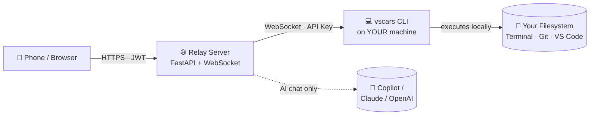

<div align="center">


# VSCARS

### VS Code As a Remote Service

**Your dev machine in your pocket.** Run commands, edit files, chat with AI, and ship code — from any phone, tablet, or browser, anywhere on the planet.

[](https://www.python.org)
[](https://fastapi.tiangolo.com)
[](LICENSE)
[](https://stripe.com)

[**Landing Page**](https://vscars.latenightstack.com) · [**Quick Start**](#quick-start) · [**Pricing**](#pricing) · [**Architecture**](#architecture) · [**FAQ**](#faq)

</div>

---

## What is VSCARS?

VSCARS is a **mobile-first remote bridge to your development machine**. It exposes a secure, permissioned web UI that lets you drive your local (or any registered) machine from anywhere — run builds, chat with Copilot, stage commits, browse files, and execute workflows without ever opening your laptop.

Unlike SSH or VS Code Tunnels, VSCARS is built around three ideas:

1. **Your machine stays yours.** Pro+ users run every tool on their **own** registered machine via the `vscars` CLI agent. Nothing executes on the relay server.
2. **Permissions that respect seniority.** Role-based gates on file read, write, shell, and AI — tuned per user or per plan.
3. **Mobile-grade UX.** Live-streaming command output, one-tap workflows, AI commit messages, and an onboarding wizard designed for thumbs.

---

## Why VSCARS?

| | SSH / Tunnels | VS Code Web | **VSCARS** |
|---|:-:|:-:|:-:|
| Works from phone browser | ⚠️ clunky | ⚠️ desktop-focused | ✅ built for mobile |
| Live streaming command output | ✅ | ✅ | ✅ WebSocket |
| Role-based permissions | ❌ all-or-nothing | ❌ | ✅ 4 granular perms |
| AI Copilot from mobile | ❌ | ⚠️ | ✅ multi-provider |
| Runs tools on **your** machine (not server) | N/A | ❌ | ✅ CLI relay |
| Idea capture + workflows + git panel | ❌ | ❌ | ✅ |
| Self-hostable with license key | ❌ | ⚠️ | ✅ |

---

## Features

### Core
- 🎛️ **15 built-in tools** — open/create/edit/delete files, run commands, git ops, project scaffolding, browse directories
- 🤖 **Copilot Agent** — run the real GitHub Copilot CLI agent (Claude Opus / GPT-5.x) in silent, non-interactive mode
- 🧠 **Multi-provider AI chat** — GitHub Copilot, Claude (Anthropic), or OpenAI — auto-picks the first configured key
- ⚡ **Live command streaming** — WebSocket-powered real-time stdout/stderr to your phone
- 🌍 **Global access via Ngrok** — one-command tunnel to your machine, or deploy behind any reverse proxy

### Productivity
- 💡 **Idea Vault** — capture thoughts on the go, tag & mark done — `/api/ideas`
- 🌿 **AI Git Panel** — status, diff, stage-all, AI commit messages, commit, push — `/api/git/*`
- ⚡ **Saved Workflows** — name-and-save command shortcuts with icons — `/api/workflows`
- ☀️ **Morning Brief** — dashboard widgets: commands today, pending ideas, workflow count — `/api/dashboard/brief`
- 🔑 **Session management** — view and revoke active JWTs — `/api/auth/sessions`
- ⊕ **FAB** — bottom-right floating quick-action button on mobile

### Security & Billing
- 🔐 **JWT auth + Argon2 passwords** — production-grade secrets, token revocation
- 📧 **Password reset via email** (Resend) — full forgot-password flow with 1-hour signed tokens
- 🛡️ **Command blocklist** — 15+ regex patterns block `rm -rf /`, fork bombs, `/etc/passwd` overwrites, etc.
- 🔒 **Security headers** — CSP-ready, HSTS, X-Frame-Options, Referrer-Policy
- 💳 **Stripe billing** — checkout, customer portal, webhook-driven plan sync
- 🗝️ **License keys** — HMAC-SHA256 signed, offline-validatable for self-hosted tier

---

## Architecture

VSCARS uses a **relay architecture**: the server is a coordinator, not an executor.



| Component | Location | Purpose |
|-----------|----------|---------|
| **Relay server** | `app/main.py` + `app/relay.py` | FastAPI app, auth, billing, WebSocket router |
| **CLI agent** | `cli/vscars/` | `pip install`-able WebSocket client that executes tools locally |
| **Web UI** | `static/` | Vanilla JS mobile-first PWA |
| **Tools** | `app/tools.py` | 15 tool handlers + multi-provider AI chat |
| **Billing** | `app/billing/` | Stripe checkout, portal, license key generator |

**Free users** get AI chat only — zero filesystem, terminal, or git access. **Pro+ users** register a machine with `vscars init`, and every tool call proxies through the WebSocket relay to their own machine. **Superusers** (the relay owner) still execute locally — because they're controlling the server's own host.

---

## Pricing

| | **Free** | **Pro** | **Team** | **Self-Hosted** |
|---|:-:|:-:|:-:|:-:|
| Price | $0 | **$9/mo** | **$29/mo** | **$19/mo** or **$49 lifetime** |
| Daily API calls | 50 | 1,000 | unlimited | unlimited |
| AI chat (Copilot/Claude/OpenAI) | ✅ | ✅ | ✅ | ✅ |
| Run tools on your machine | ❌ | ✅ | ✅ | ✅ |
| Shell, git, file edit | ❌ | ✅ | ✅ | ✅ |
| Multi-machine | ❌ | 1 | unlimited | unlimited |
| Own your relay server | ❌ | ❌ | ❌ | ✅ |
| License key | — | — | — | HMAC-signed, offline-valid |

Free users never touch the host filesystem — by design. That's what unlocks the "safely hostable SaaS" model.

---

## Quick Start

### 1. Clone & Install

```bash
git clone https://github.com/latenightstack/vscars.git
cd vscars
python3 -m venv .venv && source .venv/bin/activate
pip install -r requirements.txt
```

### 2. Configure `.env`

```bash
cp .env.example .env
# Required:  SECRET_KEY (auto-generated if blank) · SUPERUSER_PHONE
# Optional:  GITHUB_TOKEN · ANTHROPIC_API_KEY · OPENAI_API_KEY
# Billing:   STRIPE_SECRET_KEY · STRIPE_PRICE_* · LICENSE_SIGNING_KEY
# Email:     RESEND_API_KEY · FROM_EMAIL
```

### 3. Launch

```bash
python main.py
```

```text
╔══════════════════════════════════════════╗
║   VSCARS — VS Code As a Remote Service   ║
╠══════════════════════════════════════════╣
║   Server:    http://0.0.0.0:8000         ║
║   API:       http://0.0.0.0:8000/api     ║
║   App:       http://0.0.0.0:8000/app     ║
╚══════════════════════════════════════════╝
```

Open **`http://localhost:8000`** — you'll see the landing page. Click **Open App** → register (first user becomes superuser) → follow the 3-step onboarding wizard.

### 4. Connect Your Machine (Pro+)

On the machine you want to control remotely:

```bash
pip install git+https://github.com/latenightstack/vscars.git#subdirectory=cli
vscars init --api-key vscars_<your_key>
vscars start
```

Your machine now appears in the **Machines** tab. All tools will proxy to it over WebSocket.

---

## API Reference

### Auth
```http
POST   /api/auth/register            Create account (first user = superuser)
POST   /api/auth/login               Returns JWT
GET    /api/auth/me                  Current user + plan + usage
POST   /api/auth/logout              Revoke current token
POST   /api/auth/forgot-password     Trigger reset email
POST   /api/auth/reset-password      Consume reset token
GET    /api/auth/sessions            List active sessions
POST   /api/auth/api-key/generate    Mint a CLI key (shown once)
```

### Tools & Execution
```http
GET    /api/tools                    List available tools
POST   /api/tools/execute            Run a tool (proxies to machine for Pro+)
GET    /api/tools/history            Command log
GET    /api/tools/conversations      AI chat history
WS     /ws/stream?token=...          Live streaming command output
WS     /ws/agent/{machine_token}     CLI agent connection
```

### Productivity
```http
GET/POST/PUT/DELETE /api/ideas       Idea Vault CRUD
GET/POST/DELETE     /api/workflows   Saved Workflows
POST /api/workflows/{id}/run
GET  /api/git/status                 Git state
POST /api/git/commit                 AI-assisted commit
GET  /api/dashboard/brief
```

### Machines
```http
POST   /api/machines/register        Called by `vscars init`
GET    /api/machines                 List + connection status
DELETE /api/machines/{machine_id}
```

### Billing
```http
GET    /api/billing/status                   Current plan + usage
POST   /api/billing/checkout                 Stripe Checkout URL
GET    /api/billing/portal                   Stripe Billing Portal
POST   /api/billing/webhook                  Stripe webhooks (raw body)
POST   /api/billing/validate-license         Activate self-hosted key
POST   /api/billing/admin/generate-license   [SUPERUSER]
```

### Admin
```http
POST /api/access/request-via-qr
GET  /api/access/pending-requests    [SUPERUSER]
POST /api/access/approve/{id}        [SUPERUSER]
GET  /api/permissions/{user_id}      [SUPERUSER]
PUT  /api/permissions/{user_id}      [SUPERUSER]
```

---

## Built-in Tools

| Tool | Permission | Description |
|------|:---:|-------------|
| `open_file` | view | Open file in VS Code at a line |
| `read_file` | view | Return file contents |
| `list_files` | view | Directory listing |
| `browse_directory` | view | Tree browser with project detection |
| `git_status` | view | Branch + staged/unstaged summary |
| `get_workspace_info` | view | Tool versions + disk + workspace |
| `create_file` | edit | Create new file |
| `edit_file` | edit | Replace text in a file |
| `delete_file` | edit | Delete a file |
| `create_project` | edit | Scaffold python/node/react/flask/fastapi |
| `run_command` | commands | Shell exec (sandboxed + blocklist) |
| `git_command` | commands | Run git commands |
| `open_terminal` | commands | Open Terminal at a path |
| `ask_copilot` | copilot | Query GitHub Models (GPT-4o) |
| `ask_ai` | copilot | **Multi-provider**: Copilot / Claude / OpenAI auto-routing |
| `copilot_agent` | copilot | Run Copilot CLI agent (silent, `--allow-all`) |

---

## Tech Stack

**Backend** · FastAPI · SQLAlchemy · SQLite (swap for Postgres in prod) · JWT + Argon2 · slowapi rate-limiting · Stripe SDK · Resend email · pyngrok

**Frontend** · Vanilla JS (no build step) · CSS custom properties · PWA manifest · Service Worker ready · WebSocket streaming

**CLI** · Python 3.9+ · `websockets` · local executor mirroring `tools.py` · auto-reconnect · config at `~/.vscars/config.json`

---

## Project Structure

```
vscars/
├── app/
│   ├── main.py              FastAPI app, WebSocket, security headers
│   ├── auth.py              JWT, Argon2, token revocation
│   ├── database.py          12+ SQLAlchemy models, auto-migration
│   ├── schemas.py           Pydantic request/response models
│   ├── config.py            env loading + auto-secret generation
│   ├── tools.py             15 tool handlers + multi-provider AI
│   ├── relay.py             WebSocket relay (server ↔ CLI)
│   ├── trust.py             Device trust scoring
│   ├── git_ops.py           Git wrappers (no shell=True)
│   ├── email.py             Resend integration (welcome, reset, license)
│   ├── billing/
│   │   ├── plan_limits.py   PLAN_LIMITS · enforce_plan_limits · apply_plan_to_permissions
│   │   ├── license.py       HMAC-SHA256 license keys
│   │   ├── stripe_client.py Checkout, portal, webhook validation
│   │   └── routes.py        /api/billing/*
│   └── utils/
│       ├── qr_code.py
│       └── ngrok_helper.py
├── cli/                     `vscars` pip package
│   ├── setup.py
│   └── vscars/
│       ├── agent.py         WebSocket client
│       ├── executor.py      Local tool executor
│       └── config.py        ~/.vscars/config.json
├── static/
│   ├── landing.html         Marketing page (purple→cyan)
│   ├── index.html           App shell
│   ├── style.css            Design system v11.0
│   └── script.js            All frontend logic
├── deploy/                  nginx.conf · systemd unit · deploy.sh
├── main.py                  Entry point → uvicorn
├── requirements.txt
└── .env                     Config (gitignored)
```

---

## Security

VSCARS treats remote shell access as the high-stakes surface it is:

- 🔐 **Argon2id** password hashing (no 72-byte bcrypt limit)
- 🎫 **JWT** with per-token JTI for revocation; logout actually revokes
- 🛡️ **Security headers** — `X-Frame-Options: DENY`, HSTS (when `FORCE_HTTPS=true`), nosniff, Referrer-Policy
- 🚫 **Command blocklist** — regex-filtered in `run_command` AND the WebSocket stream endpoint
- 🧱 **Path sandbox** — every tool call resolves paths against the workspace root; `..` traversal blocked
- 📜 **Rate limiting** — 5/min on login, 3/min on password reset, 30/min on API
- 🔑 **License keys** — offline HMAC verification; no phone-home required
- 📊 **Activity log** — every tool execution stored in `command_logs` with status + params

**Responsible disclosure:** security@latenightstack.com

---

## FAQ

<details>
<summary><b>Does my laptop have to be on?</b></summary>

For Pro+ tools (shell, git, file edit), yes — the `vscars` CLI runs on your machine and the relay proxies to it. Free AI chat works without any machine.
</details>

<details>
<summary><b>Is it safe to expose my machine to the internet?</b></summary>

Safer than SSH if used correctly. All traffic is over HTTPS (Ngrok or your own TLS), authenticated with rotating JWTs, and every dangerous command pattern is blocked before exec. Don't run the server as root, don't disable the blocklist, rotate API keys. For maximum security, use the Self-Hosted tier behind a VPN.
</details>

<details>
<summary><b>Do I need GitHub Copilot?</b></summary>

No. VSCARS supports **GitHub Copilot**, **Claude** (Anthropic), and **OpenAI** directly — whichever API key you set wins. The `ask_ai` tool auto-picks the first available provider.
</details>

<details>
<summary><b>SaaS vs Self-Hosted — which is better?</b></summary>

**SaaS** is zero-config: sign up, install the CLI, done. **Self-Hosted** gives you your own relay — nothing leaves your infrastructure. License keys are HMAC-signed so they work offline forever.
</details>

<details>
<summary><b>Can I use this with my existing VS Code setup?</b></summary>

Yes. VSCARS is a bridge, not a replacement. Your local VS Code keeps running exactly as before — VSCARS just gives you a mobile remote control.
</details>

<details>
<summary><b>What happens if I hit my daily API limit?</b></summary>

The app returns HTTP 429 with an upgrade modal. Your machine connection stays open; only AI/tool calls are gated. Limits reset at UTC midnight.
</details>

---

## Roadmap

- [ ] Native iOS + Android apps (PWA today)
- [ ] Postgres migration path (SQLite fine for self-hosted)
- [ ] Team workspaces with shared workflows
- [ ] Audit log export (SOC 2 prep)
- [ ] Webhook integrations (Slack, Discord on command complete)
- [ ] SSO (Google, GitHub, Okta)
- [ ] Electron wrapper for desktop

---

## Contributing

PRs welcome. Good first issues are labeled [`good-first-issue`](https://github.com/latenightstack/vscars/labels/good-first-issue). Before submitting:

```bash
ruff check app/ cli/
mypy app/
python -c "from app.main import app; print('✓ imports ok')"
```

---

## License

MIT © 2026 Late Night Stack. See [LICENSE](LICENSE).

---

<div align="center">

**Built for developers who refuse to wait until they're back at their desk.**

</div>
